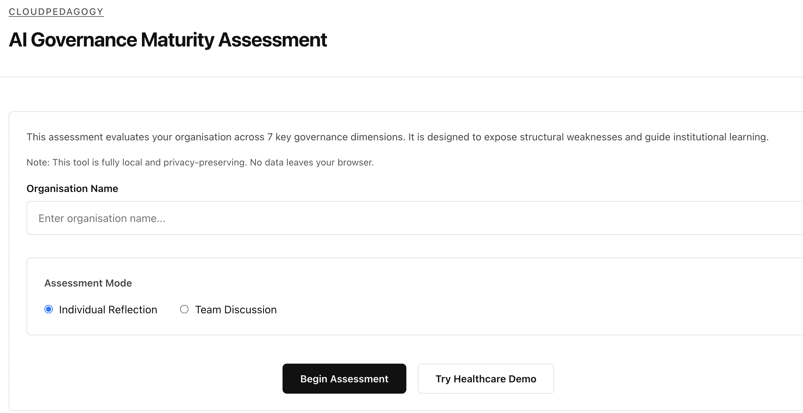

# CloudPedagogy AI Governance Maturity Assessment

An institutional self-assessment instrument for evaluating organisational readiness in governing AI-supported systems.

## Overview

This tool is a key component of the **Human–AI Governance Engineering** suite within the CloudPedagogy ecosystem. Built on **Capability-Driven Development (CDD)** principles, it prioritizes the interpretation of governance maturity over simple numerical scoring.

### Strategic Context
- **Governance-First**: Designed to reveal organisational blind spots and structural fragility.
- **Insight-Driven**: Generates interpreted patterns and fragility signals, not just a score.
- **Privacy-Preserving**: Runs entirely in the browser; all data stays in `localStorage`.

---

## 🌐 Live Application (Local-First, Privacy-Preserving)

👉 http://cloudpedagogy-ai-governance-maturity-assessment.s3-website.eu-west-2.amazonaws.com/

This is a fully functional, browser-based application designed for real-world use.

- Runs entirely client-side (no backend)
- All data is stored locally in your browser (localStorage)
- No data is transmitted, stored, or shared externally
- No login or account required

**Note:** Your data will remain on your device unless you export it or clear your browser storage.

---

## 🖼️ Interface Preview



*Example view of the Governance Profile showing maturity distribution, interpreted patterns, and fragility signals.*

---
## Usage Instructions

### 1. Initial Setup
Choose between **Individual Reflection** (for personal assessment) or **Team Discussion** (for collective workshops). Enter your organisation name to begin.

### 2. Performing the Assessment
Navigate through the 7 governance dimensions. For each dimension:
- Review the **Reflection Scaffold** to guide your thinking.
- Select the **Maturity Level (0-3)** that best represents your current state.
- Capture **Reflective Notes** to document evidence or specific observations.

### 3. Reviewing the Governance Profile
Upon completion, the tool generates a **Governance Profile**:
- **Strong/Developing/Weak Areas**: Categorized based on your input.
- **Interpreted Patterns**: Identification of structural imbalances (e.g., strong practice vs. weak oversight).
- **Fragility Signals**: Warnings regarding potential governance failure points.
- **Reflection Prompts**: Targeted questions for deeper institutional discussion.

### 4. Exporting Results
Export your profile in **JSON** (for data archival), **Markdown** (for reports), or **PDF** (via the Print button).

---

## Deployment Guide (AWS S3)

This application is a **static web app** and is fully compatible with AWS S3 static website hosting.

### 1. Build the Application
Run the following command to generate the production-ready files:
```bash
npm run build
```
This will create a `dist/` directory containing `index.html` and the required assets.

### 2. Upload to S3
1. Create a new S3 bucket (e.g., `ai-governance-assessment.yourdomain.com`).
2. In the **Properties** tab, enable **Static website hosting**.
3. Set the **Index document** to `index.html`.
4. In the **Permissions** tab, disable **Block all public access** (unless using a CDN like CloudFront).
5. Upload all files from the `dist/` folder to the root of your bucket.

### 3. Verification
Access the bucket URL (e.g., `http://ai-governance-assessment.yourdomain.com.s3-website-region.amazonaws.com`). The app will load with all features fully functional.

---

## Local Development

1. **Install Dependencies**: `npm install`
2. **Start Dev Server**: `npm run dev`
3. **Build Prod**: `npm run build`

## License

This project is open-source under the MIT License.

Part of the CloudPedagogy ecosystem.
